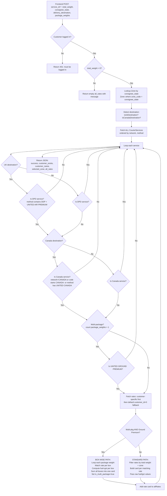

# getUpsRate() — Current Rate Calculation Documentation

> **File**: [`app/Http/Controllers/customerController.php`](app/Http/Controllers/customerController.php:3003) (line 3003)
> **Route**: `POST /ups-rate` → [`routes/web.php`](routes/web.php:596) (line 596, name: `customer.ups.rate`)
> **Frontend caller**: [`resources/views/customer/create-shipment.blade.php`](resources/views/customer/create-shipment.blade.php:8806) (line 8806)

---

## 1. Overview

The `getUpsRate()` function calculates courier shipping rates for a customer's shipment. It takes the shipment's weight, destination, and consignee state as input, looks up matching rate cards from the database, applies fuel surcharge and GST, and returns a list of available service rates for the customer to choose from.

The frontend **always sends `service_id` as an empty string** (`''`), which triggers the **ALL-SERVICES mode** — meaning rates are returned for every applicable courier service at once.

---

## 2. Inputs (Request Payload)

The frontend sends a POST request with this JSON body:

| Field | Type | Description | Example |
|---|---|---|---|
| `service_id` | string | Always `''` (empty) — triggers ALL-SERVICES mode | `""` |
| `total_weight` | float | Total chargeable weight in kg | `5.5` |
| `consignee_state` | string | Consignee's state/zone code | `"NY"`, `"CA"` |
| `delivery_destination` | string | Full destination name | `"US- United State of America"`, `"UK - United Kingdom"`, `"Canada"` |
| `package_weights` | array | Per-box chargeable weights (for multi-package) | `[2.5, 3.0]` |

**Frontend code** ([`create-shipment.blade.php`](resources/views/customer/create-shipment.blade.php:8812)):
```javascript
body: JSON.stringify({
    service_id: '',
    total_weight: totalWeight,
    consignee_state: consigneeState,
    delivery_destination: deliveryDestination,
    package_weights: packageWeights
})
```

---

## 3. Step-by-Step Calculation Flow

### Step 1: Authentication Check (lines 3018–3027)

```php
$customer = auth()->guard('customer')->user();
$customerId = $customer ? $customer->id : 0;
```

- Gets the currently logged-in customer.
- If no customer is logged in → returns `401` with message `"You must be logged in to view rates."`
- `$customerId` is used later to fetch customer-specific rates.

---

### Step 2: Weight Guard (lines 3029–3040)

```php
if ($totalWeight <= 0) {
    return response()->json([
        'success' => true,
        'customer_exists' => false,
        'all_rates' => [],
        'message' => 'Please enter Actual Weight (Act. Wt) greater than 0 to view rates.',
    ]);
}
```

- If total weight is 0 or less → returns an **empty rate list** with a message.
- This prevents showing rates when the user hasn't entered any weight yet.

---

### Step 3: Zone Lookup (lines 3042–3046)

```php
$zone = null;
if (!empty($consigneeState)) {
    $zone = \App\Models\Zone::where('zone_code', $consigneeState)->first();
}
```

- Looks up the [`Zone`](app/Models/Zone.php) record from the `zones` table where `zone_code` matches the consignee's state.
- The zone's **`zone_number_testing`** field is critical — it's used later to match against rate rows' `zone_no` field.
- If no zone is found, `$zone` stays `null` and only zone-independent rates will match.

**Zone table fields used:**
| Field | Purpose |
|---|---|
| `zone_code` | Matched against `consignee_state` (e.g. "NY") |
| `zone_number_testing` | Matched against rate's `zone_no` |
| `zone_name` | Returned in response for display |
| `zone_code` | Returned in response for display |

---

### Step 4: Destination Detection (lines 3048–3055)

Two boolean flags are set based on the `delivery_destination` string:

```php
$isUkDestination = ($deliveryDestination === 'UK - United Kingdom');
$isCanadaDestination = ($deliveryDestination === 'Canada');
```

| Flag | Condition | Effect |
|---|---|---|
| `$isUkDestination` | destination is exactly `"UK - United Kingdom"` | Only DPD services shown |
| `$isCanadaDestination` | destination is exactly `"Canada"` | Only Canada services shown |
| (neither) | Any other destination | Normal services shown (no DPD, no Canada) |

---

### Step 5: Fetch ALL Courier Services (line 3059)

```php
$allServices = \App\Models\CourierService::orderBy('network')->orderBy('method')->get();
```

- Fetches **every** [`CourierService`](app/Models/CourierService.php) record from the database.
- Ordered by `network` first, then `method` — so the rate cards appear in a consistent order on the frontend.

**CourierService table fields used:**
| Field | Purpose |
|---|---|
| `id` | Used to fetch rates |
| `network` | Returned in response (e.g. "UPS", "DPD", "CANADA") |
| `method` | Service name (e.g. "UNITED AIR PREMIUM DDP") — used for filtering |
| `method_code` | Returned in response |
| `tat` | Turnaround time (e.g. "2-3 days") — returned in response |
| `scode` | Service code — returned in response |

---

### Step 6: Loop Each Service — Apply 3 Filters

For **each** courier service, three filters are applied in sequence. If any filter says "skip", the service is excluded entirely.

#### Filter A: UK / DPD Rule (lines 3064–3073)

Uses helper [`isPostShippingMethod()`](app/Http/Controllers/customerController.php:5854) which returns `true` if the method name contains **both** "DDP" **and** "UNITED AIR PREMIUM".

| Destination | DPD Service? | Result |
|---|---|---|
| UK | Yes (DPD) | ✅ Show |
| UK | No (non-DPD) | ❌ Skip |
| Non-UK | Yes (DPD) | ❌ Skip |
| Non-UK | No (non-DPD) | ✅ Show |

**Logic**: DPD (PostShipping) services are only available for UK destinations. For UK, ONLY DPD services are shown. For all other destinations, DPD services are hidden.

```php
$isDpd = $this->isPostShippingMethod($service->method);
if ($isUkDestination && !$isDpd) continue;   // UK: skip non-DPD
if (!$isUkDestination && $isDpd) continue;    // Non-UK: skip DPD
```

---

#### Filter B: Canada Rule (lines 3075–3084)

Uses helper [`isCanadaService()`](app/Http/Controllers/customerController.php:5877) which returns `true` if:
- `network` is `"CANADA"`, **OR**
- `service_code` starts with `"CANADA-"`, **OR**
- `method` contains `"UNITED CANADA"`

| Destination | Canada Service? | Result |
|---|---|---|
| Canada | Yes | ✅ Show |
| Canada | No | ❌ Skip |
| Non-Canada | Yes | ❌ Skip |
| Non-Canada | No | ✅ Show |

**Logic**: Canada services (CANADA-DDP, CANADA-ECOM) are only shown for Canada destinations. For Canada, ONLY Canada services are shown. For all other destinations, Canada services are hidden.

```php
$isCanadaSvc = $this->isCanadaService($service);
if ($isCanadaDestination && !$isCanadaSvc) continue;   // Canada: skip non-Canada
if (!$isCanadaDestination && $isCanadaSvc) continue;    // Non-Canada: skip Canada
```

---

#### Filter C: Multi-Package Rule (lines 3086–3092)

```php
$isMultiPackage = is_array($packageWeights) && count($packageWeights) > 1;
```

| Multi-Package? | Service | Result |
|---|---|---|
| Yes (2+ boxes) | "UNITED GROUND PREMIUM" | ✅ Show |
| Yes (2+ boxes) | Any other service | ❌ Skip |
| No (0 or 1 box) | Any service | ✅ Show (if passes other filters) |

**Logic**: When the user has entered more than one package/box, ONLY the "United Ground Premium" service is offered. All other services are hidden. The comparison is case-insensitive (`strcasecmp`).

```php
if ($isMultiPackage && strcasecmp($service->method, 'UNITED GROUND PREMIUM') !== 0) {
    continue;
}
```

---

### Step 7: Fetch Rates for the Service (lines 3094–3114)

Two-tier rate lookup from the [`CourierRate`](app/Models/UpsRate.php) table (actually the `courier_rates` table):

#### Tier 1: Customer-Specific Rates
```php
$rates = \App\Models\CourierRate::where('customer_id', $customerId)
    ->where('service_id', $service->id)
    ->orderBy('wt_range_start')
    ->get();
```

If customer-specific rates exist → `$customerRatesExist = true` (used in the response to show "Custom Rates" vs "Default Rates" badge).

#### Tier 2: Default Rates (fallback)
```php
if ($rates->isEmpty() && $customerId !== 0) {
    $rates = \App\Models\CourierRate::where('customer_id', 0)
        ->where('service_id', $service->id)
        ->orderBy('wt_range_start')
        ->get();
}
```

If no customer-specific rates found → fall back to default rates where `customer_id = 0`.

**CourierRate table fields used:**
| Field | Type | Purpose |
|---|---|---|
| `id` | int | Rate ID (returned in response) |
| `customer_id` | int | 0 = default rate, else = customer-specific |
| `service_id` | int | Links to CourierService |
| `wt_range_start` | float | Weight range lower bound (kg) |
| `wt_range_end` | float | Weight range upper bound (kg) |
| `zone_no` | int/null | null/0 = zone-independent, else = zone number |
| `price` | float | Base price (₹) |
| `fuel_percentage` | float | Fuel surcharge percentage |
| `fuel_charge` | float | Pre-computed fuel amount (if > 0, used directly) |
| `gst_percentage` | float | GST percentage |
| `gst_amount` | float | Pre-computed GST amount (if > 0, used directly) |

---

### Step 8: Calculate the Rate (2 Paths)

After fetching rates, the function chooses one of two calculation paths:

#### Path A: Multi-Package Box-Wise Calculation (lines 3125–3224)

**Triggered when**: `$isMultiPackage` is true AND service method is "UNITED GROUND PREMIUM"

**How it works:**
1. Loop through each package weight in `$packageWeights`
2. For each box, find a matching rate row where:
   - Box weight is between `wt_range_start` and `wt_range_end` **AND**
   - `zone_no` is null/0 (zone-independent) **OR** `zone_no` equals `zone->zone_number_testing`
3. If **any box** has no matching rate → skip the entire service (`$allBoxesMatched = false`)
4. For each matched box, compute:
   - `base` = rate's price
   - `fuel` = fuel_charge > 0 ? fuel_charge : (base × fuel_percentage / 100)
   - `gst` = gst_amount > 0 ? gst_amount : ((base + fuel) × gst_percentage / 100)
   - `total` = base + fuel + gst
5. Sum all boxes into combined totals
6. Build ONE combined rate card with:
   - `price` = sum of all box base prices
   - `fuel_charge` = sum of all box fuel amounts
   - `gst_amount` = sum of all box GST amounts
   - `fuel_percentage` = 0 (zeroed so frontend doesn't recompute)
   - `gst_percentage` = 0 (zeroed so frontend doesn't recompute)
   - `is_multi_package` = true
   - `box_breakdown` = array of per-box details

```php
foreach ($packageWeights as $pkgWt) {
    $pkgWt = floatval($pkgWt);
    if ($pkgWt <= 0) $pkgWt = 1; // default 1kg if missing

    // Find matching rate row for this box
    $boxMatched = null;
    foreach ($rates as $r) {
        if (!($pkgWt >= $r->wt_range_start && $pkgWt <= $r->wt_range_end)) continue;
        $zoneNo = $r->zone_no;
        if ($zoneNo === null || $zoneNo == 0) { $boxMatched = $r; break; }
        if ($zone && $zone->zone_number_testing !== null && $zoneNo == $zone->zone_number_testing) {
            $boxMatched = $r; break;
        }
    }
    // ... compute and accumulate
}
```

---

#### Path B: Standard Single Rate Calculation (lines 3225–3271)

**Triggered when**: NOT multi-package, OR service is not "UNITED GROUND PREMIUM"

**How it works:**
1. Filter the rate collection to find rows where:
   - `totalWeight` is between `wt_range_start` and `wt_range_end` **AND**
   - `zone_no` is null/0 (zone-independent) **OR** `zone_no` equals `zone->zone_number_testing`
2. For **each** matching rate row, build a separate rate card

```php
$matchedRates = $rates->filter(function ($r) use ($totalWeight, $zone) {
    if (!($totalWeight >= $r->wt_range_start && $totalWeight <= $r->wt_range_end)) {
        return false;
    }
    $zoneNo = $r->zone_no;
    if ($zoneNo === null || $zoneNo == 0) return true;        // Zone-independent
    if ($zone && $zone->zone_number_testing !== null
        && $zoneNo == $zone->zone_number_testing) return true; // Zone-matched
    return false;
});
```

**Note**: Unlike Path A, the fuel/GST is **NOT** pre-computed here. The raw `fuel_charge`, `fuel_percentage`, `gst_percentage`, `gst_amount` values are passed directly to the frontend, which computes them using the same formula.

---

### Step 9: The Fuel/GST Formula

This is the core money calculation. It appears in 4+ places in the code but always follows the same logic:

```
┌─────────────────────────────────────────────────────────┐
│  FUEL CALCULATION                                       │
│                                                         │
│  IF fuel_charge > 0:                                    │
│      fuel = fuel_charge          (use stored amount)    │
│  ELSE:                                                  │
│      fuel = price × fuel_percentage / 100  (compute)    │
│                                                         │
├─────────────────────────────────────────────────────────┤
│  GST CALCULATION                                        │
│                                                         │
│  IF gst_amount > 0:                                     │
│      gst = gst_amount             (use stored amount)   │
│  ELSE:                                                  │
│      gst = (price + fuel) × gst_percentage / 100        │
│                                                         │
├─────────────────────────────────────────────────────────┤
│  TOTAL                                                  │
│                                                         │
│  total = price + fuel + gst                             │
└─────────────────────────────────────────────────────────┘
```

**Key insight**: GST is calculated on `(price + fuel)`, not just on price. So fuel is computed first, then GST includes the fuel amount in its base.

**Where it's computed:**
| Location | Computes? |
|---|---|
| Path A (multi-package) — backend | ✅ Yes, backend computes and passes fixed amounts |
| Path B (standard) — backend | ❌ No, passes raw values; frontend computes |
| Frontend JS ([`create-shipment.blade.php`](resources/views/customer/create-shipment.blade.php:8860)) | ✅ Yes, for Path B cards |

---

### Step 10: Build the Rate Card (Response Array)

Each rate card is an associative array pushed into `$allRates`:

#### Standard Rate Card (Path B):
```php
[
    'rate_id'         => $matchedRate->id,
    'service_id'      => $service->id,
    'method'          => $service->method,
    'method_display'  => $service->method . ' ' . $service->tat,
    'network'         => $service->network,
    'method_code'     => $service->method_code,
    'tat'             => $service->tat,
    'delivery_days'   => $service->tat,
    'scode'           => $service->scode,
    'price'           => $matchedRate->price,           // raw base price
    'zone_no'         => $matchedRate->zone_no,
    'zone_name'       => $zone->zone_name or null,       // if zone matched
    'zone_code'       => $zone->zone_code or null,       // if zone matched
    'fuel_charge'     => $matchedRate->fuel_charge,      // raw (frontend computes)
    'fuel_percentage' => $matchedRate->fuel_percentage,  // raw
    'gst_percentage'  => $matchedRate->gst_percentage,   // raw
    'gst_amount'      => $matchedRate->gst_amount,       // raw
]
```

#### Multi-Package Rate Card (Path A):
```php
[
    'rate_id'         => $firstMatchedRate->id,
    'service_id'      => $service->id,
    'method'          => $service->method,
    'method_display'  => $service->method . ' ' . $service->tat,
    'network'         => $service->network,
    'method_code'     => $service->method_code,
    'tat'             => $service->tat,
    'delivery_days'   => $service->tat,
    'scode'           => $service->scode,
    'price'           => $combinedBase,                  // summed base
    'zone_no'         => $firstMatchedRate->zone_no,
    'zone_name'       => $zone->zone_name or null,
    'zone_code'       => $zone->zone_code or null,
    'fuel_charge'     => $combinedFuel,                  // pre-computed sum
    'fuel_percentage' => 0,                              // zeroed (no recompute)
    'gst_percentage'  => 0,                              // zeroed (no recompute)
    'gst_amount'      => $combinedGst,                   // pre-computed sum
    'is_multi_package'=> true,
    'box_breakdown'   => [                               // per-box details
        ['box' => 1, 'weight' => 2.5, 'base' => 100, 'fuel' => 10, 'gst' => 19.8, 'total' => 129.8],
        ['box' => 2, 'weight' => 3.0, 'base' => 120, 'fuel' => 12, 'gst' => 23.76, 'total' => 155.76],
    ],
]
```

---

### Step 11: Return JSON Response (lines 3274–3289)

```php
return response()->json([
    'success'         => true,
    'customer_exists' => $customerRatesExist,    // true if customer-specific rates found
    'customer_name'   => $customer->first_name . ' ' . $customer->last_name,
    'selected_zone'   => [
        // If zone found:
        'zone_id'     => $zone->id,
        'zone_number' => $zone->zone_number_testing,
        'zone_name'   => $zone->zone_name,
        'zone_code'   => $zone->zone_code,
        'state'       => $consigneeState,
        // If no zone found:
        // 'state' => $consigneeState,
        // 'message' => 'No zone found for the selected state'
    ],
    'all_rates' => $allRates,   // array of rate cards
]);
```

---

## 4. Zone + Weight Matching Logic (Critical)

This is the most important matching logic, used in both paths:

```
A rate row matches IF AND ONLY IF:

  1. WEIGHT MATCHES:
     totalWeight >= wt_range_start  AND  totalWeight <= wt_range_end

  2. AND ZONE MATCHES (one of):
     a. zone_no is NULL or 0  →  Zone-independent rate (always matches)
     b. zone_no == zone.zone_number_testing  →  Zone-specific match

  If zone_no is set but doesn't match zone.zone_number_testing → EXCLUDED
```

**Example:**
- Total weight = 5.5 kg
- Consignee state = "NY" → Zone lookup → zone_number_testing = 3

| Rate Row | wt_range | zone_no | Matches? |
|---|---|---|---|
| Rate #1 | 1–10 kg | null | ✅ (zone-independent, weight in range) |
| Rate #2 | 1–10 kg | 3 | ✅ (zone matches, weight in range) |
| Rate #3 | 1–10 kg | 5 | ❌ (zone doesn't match) |
| Rate #4 | 11–20 kg | null | ❌ (weight out of range) |

---

## 5. Complete Flow Diagram



---

## 6. Helper Methods Used

### [`isPostShippingMethod($shippingMethod)`](app/Http/Controllers/customerController.php:5854)
Returns `true` if the method name contains **both** "DDP" **and** "UNITED AIR PREMIUM" (case-insensitive).

```php
$isDdp = str_contains($methodUpper, 'DDP');
$isAirPremium = str_contains($methodUpper, 'UNITED AIR PREMIUM');
return $isDdp && $isAirPremium;
```

### [`isCanadaService($service)`](app/Http/Controllers/customerController.php:5877)
Returns `true` if the service is a Canada-only service. Checks three fields:
- `network` === "CANADA"
- `service_code` starts with "CANADA-"
- `method` contains "UNITED CANADA"

```php
return $network === 'CANADA'
    || str_starts_with($serviceCode, 'CANADA-')
    || str_contains($method, 'UNITED CANADA');
```

---

## 7. Database Tables Involved

| Table | Model | Purpose |
|---|---|---|
| `courier_services` | [`CourierService`](app/Models/CourierService.php) | List of all available courier services (method, network, tat, scode) |
| `courier_rates` | [`CourierRate`](app/Models/UpsRate.php) | Rate cards: price, weight ranges, zone_no, fuel/gst values |
| `zones` | [`Zone`](app/Models/Zone.php) | Zone mapping: zone_code → zone_number_testing, zone_name |

### Relationships:
```
CourierService (1) ──── (many) CourierRate
    service_id ←──── service_id

Zone (1) ──── (many) CourierRate
    zone_number_testing ←──── zone_no (when zone_no > 0)

Customer (1) ──── (many) CourierRate
    customer_id ←──── customer_id (0 = default rate for all customers)
```

---

## 8. Example Scenario

**Input:**
- `total_weight` = 5.5 kg
- `consignee_state` = "NY"
- `delivery_destination` = "US- United State of America"
- `package_weights` = [5.5] (single package)

**Flow:**
1. Customer is logged in ✅
2. Weight 5.5 > 0 ✅
3. Zone lookup: `Zone::where('zone_code', 'NY')` → found, `zone_number_testing` = 3
4. `isUkDestination` = false, `isCanadaDestination` = false
5. Fetch all courier services
6. For each service:
   - Not UK → skip DPD services
   - Not Canada → skip Canada services
   - Single package → no multi-package filter
   - Fetch rates (customer-specific, or default if none)
   - Filter rates: weight 5.5 in range AND (zone_no null/0 OR zone_no = 3)
   - Build rate card for each match
7. Return all matching rate cards

**Output (simplified):**
```json
{
    "success": true,
    "customer_exists": true,
    "customer_name": "John Doe",
    "selected_zone": {
        "zone_id": 5,
        "zone_number": 3,
        "zone_name": "East Coast",
        "zone_code": "NY",
        "state": "NY"
    },
    "all_rates": [
        {
            "rate_id": 42,
            "service_id": 7,
            "method": "UNITED AIR EXPRESS",
            "method_display": "UNITED AIR EXPRESS 2-3 days",
            "network": "UPS",
            "price": 1500.00,
            "zone_no": 3,
            "fuel_charge": 0,
            "fuel_percentage": 15.00,
            "gst_percentage": 18.00,
            "gst_amount": 0
        }
    ]
}
```

**Frontend computes the final total:**
- fuel = 0 > 0? No → 1500 × 15 / 100 = **₹225**
- gst = 0 > 0? No → (1500 + 225) × 18 / 100 = **₹310.50**
- total = 1500 + 225 + 310.50 = **₹2035.50**

---

## 9. SINGLE-SERVICE Mode (Dead Code)

Lines 3292–3421 contain a SECOND code path that runs when `service_id` is **not** empty. This path:
- Looks up a single `CourierService` by ID
- Applies the same UK/Canada filters
- Returns a different response shape (`matched_rate`, `service`, `is_zone_independent`)

**This mode is NOT used anywhere** — the frontend always sends `service_id: ''`. It is effectively dead code.
