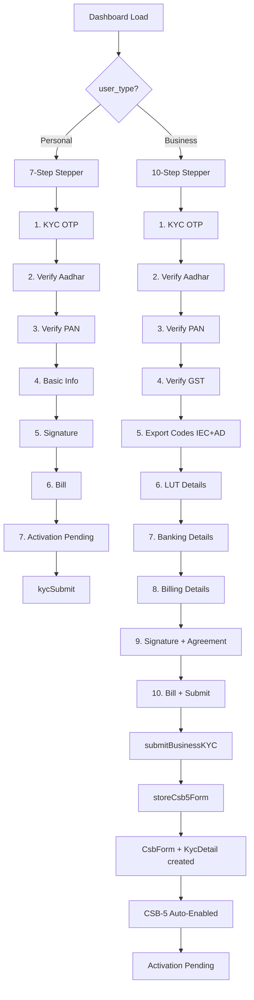

# Business KYC (CSB-V) in Dashboard Stepper — Implementation Plan

## Objective
When the customer's `business_category` maps to `user_type = 'Business'`, the dashboard "Finish KYC in seconds" stepper must show the **full Business KYC (CSB-V)** flow with all required fields. Completing it should automatically create a `CsbForm` record (enabling CSB-5) and a `KycDetail` record with `kyc_type='business'`.

## Current State
- Dashboard stepper has 7 steps: KYC Verification → Verify Aadhar → Verify PAN → Basic Info & Signing → Upload Signature → Bill → CSB V Ramp UP
- Stepper shows when `!$kycExists` (no KycDetail record)
- `kycSubmit()` controller handles the current stepper submission (creates `KycDetail` with `kyc_type` not set)
- `storeCsb5Form()` controller already handles all business KYC fields (aadhar, gst, iec, ad_code, lut, bank, billing, merchant_agreement) and creates both `CsbForm` + `KycDetail` records
- `verifyGst()` route exists at `customer.verify.gst`
- `CsbForm` model has all needed fillable fields
- `BusinessCategory` model has `user_type` field (Personal / Business)
- Dashboard view uses inline `@php` to query `KycDetail` — does NOT currently receive `userType` from controller

## Architecture Decision: Conditional Stepper
The dashboard stepper will render **two different step sets** based on `user_type`:

### Personal Flow (7 steps — current, unchanged)
1. KYC Verification (OTP)
2. Verify Aadhar
3. Verify PAN
4. Basic Info & Signing
5. Upload Signature
6. Bill
7. CSB V Ramp UP (activation pending)

### Business Flow (10 steps — NEW)
1. KYC Verification (OTP)
2. Verify Aadhar (Aadhaar Number + Upload Aadhaar front/back + Verify Aadhaar)
3. Verify PAN (PAN Number + Holder Name + DOB + Upload PAN + Verify PAN)
4. Verify GST (GST Number + Upload GST Certificate + Verify GST)
5. Export Codes (IEC Number + Upload IEC + AD Code + Upload AD Code)
6. LUT Details (LUT Expiry Date + Bond Year + Upload LUT Document) — optional/conditional
7. Banking Details (Bank Category: Public/Private + Bank Account Number)
8. Billing Details (Billing Address auto-filled from GST + Billing GST + Contact + Email)
9. Upload Signature + Agreement (Upload Authorized Signature with Company Stamp + Upload signed Merchant Agreement)
10. Bill + CSB V Ramp UP (review summary + submit → auto-enables CSB-5)

## Implementation Steps

### Step 1: Pass `userType` to dashboard view
**File:** `app/Http/Controllers/customerController.php` → `dashboard()` method

Add business category lookup:
```php
$businessCategory = BusinessCategory::find($customer->business_category_id);
$userType = $businessCategory ? $businessCategory->user_type : 'Personal';
```
Add `$userType`, `$businessCategory` to the `compact()` call.

### Step 2: Conditional step indicators in dashboard.blade.php
**File:** `resources/views/customer/dashboard.blade.php`

Wrap the step indicators in `@if($userType === 'Business')` / `@else` blocks:
- Business: 10 step indicators
- Personal: 7 step indicators (current)

### Step 3: Add Business-only step content divs
**File:** `resources/views/customer/dashboard.blade.php`

After step3-content (PAN), add new business-only steps wrapped in `@if($userType === 'Business')`:
- `step4-content` (Business): Verify GST
- `step5-content` (Business): Export Codes (IEC + AD Code)
- `step6-content` (Business): LUT Details
- `step7-content` (Business): Banking Details
- `step8-content` (Business): Billing Details
- `step9-content` (Business): Upload Signature + Agreement

Then the existing Basic Info / Signature / Bill / CSB V steps become steps 10+ for business (wrapped in `@else` for personal they stay as 4-7).

**Simpler approach:** Use two separate stepper blocks — one for Personal (7 steps), one for Business (10 steps) — each with its own step indicators + step-content divs + navigation. This avoids complex conditional renumbering inside a single stepper.

### Step 4: Add verifyGst JS function
**File:** `resources/views/customer/dashboard.blade.php`

Add `verifyGst()` JS function (mirrors `verifyAadhar()` / `verifyPan()` pattern):
- Validates GST number format (15 chars, regex)
- Fetches `{{ route('customer.verify.gst') }}`
- On success: sets `kycData.gst_number`, `kycData.gst_verified = true`, shows green status, disables button
- On failure: shows red status, re-enables button

### Step 5: Add file upload handlers for business documents
**File:** `resources/views/customer/dashboard.blade.php`

Extend `initFileUploadPreviews()` to wire up business document file inputs:
- `gstCertificateFileInput` → `gst_certificate_document`
- `iecFileInput` → `iec_document`
- `adCodeFileInput` → `ad_code_document`
- `lutDocumentFileInput` → `lut_document`
- `signatureStampFileInput` → `signature_document`
- `merchantAgreementFileInput` → `merchant_agreement`

### Step 6: Update nextStep() JS for business flow
**File:** `resources/views/customer/dashboard.blade.php`

The business stepper needs its own `nextStepBusiness()` function (or conditional inside `nextStep()`) that:
- Saves GST data when leaving step 4
- Saves IEC/AD Code when leaving step 5
- Saves LUT data when leaving step 6
- Saves banking details when leaving step 7
- Saves billing details when leaving step 8
- Saves signature + agreement when leaving step 9
- Calls `submitBusinessKYC()` when leaving step 10

### Step 7: Add submitBusinessKYC() JS function
**File:** `resources/views/customer/dashboard.blade.php`

New function that:
- Collects all kycData (aadhar, pan, gst, iec, ad_code, lut, bank, billing, signature, agreement)
- Builds a `FormData` object (for file uploads)
- Fetches `{{ route('customer.csb5-form.store') }}` (reuses existing `storeCsb5Form` controller)
- On success: shows activation pending message, sets `customer.csb_status = 2`
- On failure: shows error, re-enables button

### Step 8: Auto-fill billing address from GST
**File:** `resources/views/customer/dashboard.blade.php`

When GST is verified, auto-fill the billing address step with a note that "Billing address is derived from your GST registration." The user can edit if needed.

### Step 9: Test & verify
- `php artisan view:clear && php artisan view:cache`
- `php -l app/Http/Controllers/customerController.php`
- `php artisan route:list --name=customer.verify`
- Verify both Personal and Business steppers render correctly

## Key Design Decisions

1. **Two separate stepper blocks** (Personal vs Business) rather than conditional steps within one stepper — simpler, less error-prone, avoids renumbering complexity.

2. **Reuse `storeCsb5Form` controller** for business KYC submission — it already validates and stores all business fields, creates `CsbForm` + `KycDetail` records, and sets `csb_status = 2`.

3. **Reuse existing `verifyGst` route** — already validates GST format + checksum.

4. **File uploads via FormData** — business KYC requires actual file uploads (PDF/images), unlike the personal stepper which uses base64 signature. The `submitBusinessKYC()` function will use `FormData` + `fetch` with `multipart/form-data`.

5. **CSB-5 auto-enablement** — `storeCsb5Form` already sets `is_csb_v = true` and `csb_status = 2`, which enables CSB-5. No additional work needed.

## Mermaid Flow Diagram


