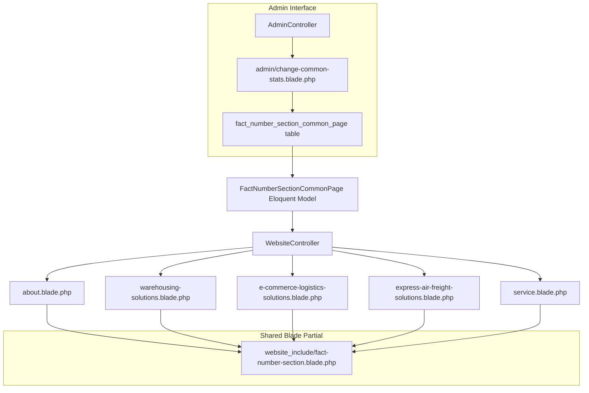

# Common Stats (Fact Number) Section — Implementation Plan

## Overview

Currently, the stats/fact-number section is duplicated across **5 pages** with different implementations:

| Page | Variable Name | Data Source | Column Naming |
|------|--------------|-------------|---------------|
| about.blade.php | `$stats` | AboutPageContent | `page_target_number`, `page_suffix`, `title` |
| warehousing-solutions.blade.php | `$statsContent` | WarehousingSolutionsPage | `content['stat_number']`, `content['suffix']`, `content['stat_label']` |
| e-commerce-logistics-solutions.blade.php | `$statsContent` | EcommerceLogisticsSolutionsPage | `content['value']`, `content['suffix']`, `content['label']` |
| express-air-freight-solutions.blade.php | `$statsContent` | ExpressAirFreightSolutionsPage | `content['value']`, `content['suffix']`, `content['label']` |
| service.blade.php | `$stats` | ServicePage | `content['stat_number']`, `content['suffix']`, `content['stat_label']` |

The goal is to create a **single shared table** (`fact_number_section_common_page`) + a reusable Blade partial so all pages reference the same data.

---

## Architecture



## Step 1: Create Migration

Create `database/migrations/YYYY_MM_DD_HHMMSS_create_fact_number_section_common_page_table.php`

**Columns:**
| Column | Type | Description |
|--------|------|-------------|
| `id` | bigIncrements | Primary key |
| `title` | string(255) | Stat label (e.g., "Cities Covered") |
| `target_number` | string(100) | The numeric value displayed as stat (e.g., "150", "100", "99") |
| `suffix` | string(50) | Suffix after number (e.g., "+", "K+", ".9%", "/7") |
| `display_order` | integer (default 0) | Sorting order |
| `status` | boolean (default true) | Active/inactive |
| `created_at` | timestamp | |
| `updated_at` | timestamp | |

**No `page_identifier` column needed** — the stats are shared globally across all pages.

## Step 2: Create Model

`app/Models/FactNumberSectionCommonPage.php`

```php
class FactNumberSectionCommonPage extends Model
{
    use HasFactory;
    
    protected $table = 'fact_number_section_common_page';
    
    protected $fillable = [
        'title',
        'target_number',
        'suffix',
        'display_order',
        'status',
    ];
    
    protected $casts = [
        'status' => 'boolean',
    ];
    
    public function scopeActive($query)
    {
        return $query->where('status', true);
    }
    
    public function scopeOrdered($query)
    {
        return $query->orderBy('display_order');
    }
}
```

## Step 3: Create Seeder

`database/seeders/FactNumberSectionCommonPageSeeder.php`

Insert 6 default stat records matching the current fallback values used across pages:

| title | target_number | suffix | display_order |
|-------|--------------|--------|--------------|
| Cities Covered | 150 | + | 0 |
| Daily Parcels | 100 | K+ | 1 |
| Delivery Riders | 5 | K+ | 2 |
| On-time Rate | 99 | .9% | 3 |
| Live Tracking | 24 | /7 | 4 |
| Happy Clients | 50 | K+ | 5 |

Register in `DatabaseSeeder.php`.

## Step 4: Create Reusable Blade Partial

`resources/views/website_include/fact-number-section.blade.php`

**Contains:**
- The `py-5 bg-white` section wrapper
- The `stats-wrapper` / `stats-container` grid
- Loop over `$commonStats` passed from controller
- Inline CSS for `.stats-wrapper`, `.stats-container`, `.stat-card`, `.stat-number-wrapper`, `.stat-label`
- The animated counter JavaScript using IntersectionObserver

The partial will use a variable `$commonStats` that must be passed from each page's controller.

**IMPORTANT CSS Changes:** The stats CSS is currently duplicated in each page's `<style>` block. The partial will include the CSS once in a `<style>` tag, allowing removal from individual pages (optional — can be done later to avoid visual regressions).

## Step 5: Update WebsiteController

Add a shared helper method `getCommonStats()`:

```php
private function getCommonStats()
{
    return \App\Models\FactNumberSectionCommonPage::active()->ordered()->get();
}
```

Then in each controller method that renders a page with stats, add:

```php
// In about():
$commonStats = $this->getCommonStats();

// In warehousingSolutions():
$commonStats = $this->getCommonStats();

// In ecommerceLogisticsSolutions():
$commonStats = $this->getCommonStats();

// In expressAirFreightSolutions():
$commonStats = $this->getCommonStats();

// In service():
$commonStats = $this->getCommonStats();
```

Pass `$commonStats` in the compact array for each relevant view.

## Step 6: Update Blade Files

Replace the stats HTML in each page with:

```blade
@include('website_include.fact-number-section')
```

**Files to modify:**
1. `resources/views/about.blade.php` — lines 527-547 (stats section + inline CSS + counter JS)
2. `resources/views/warehousing-solutions.blade.php` — lines 553-599 (stats section + inline CSS + counter JS)
3. `resources/views/e-commerce-logistics-solutions.blade.php` — lines 583-610 (stats section + inline CSS + counter JS)
4. `resources/views/express-air-freight-solutions.blade.php` — lines 177-253 (stats section + inline CSS + counter JS)
5. `resources/views/service.blade.php` — includes stats CSS at lines 3-84 and counter JS at lines 741-775

Each page has its own CSS block for the stats styling and its own counter JS. The partial will consolidate these.

## Step 7: Create Admin Interface

**Admin Route:**
```php
Route::get('/change-common-stats', [AdminController::class, 'changeCommonStats'])->name('admin.change-common-stats');
Route::post('/store-common-stats', [AdminController::class, 'storeCommonStats'])->name('admin.store-common-stats');
Route::post('/update-common-stats/{id}', [AdminController::class, 'updateCommonStats'])->name('admin.update-common-stats');
Route::delete('/delete-common-stats/{id}', [AdminController::class, 'deleteCommonStats'])->name('admin.delete-common-stats');
```

**AdminController Methods:**
- `changeCommonStats()` — show form with existing stats in a table
- `storeCommonStats(Request)` — create new stat record
- `updateCommonStats(Request, $id)` — update existing stat record
- `deleteCommonStats($id)` — delete stat record

**Admin Blade:** `resources/views/admin/change-common-stats.blade.php`
- Table showing all stats with drag-to-reorder (optional) or display_order field
- CRUD forms following same pattern as other admin pages (e.g., `change-partnership.blade.php`)

---

## Execution Order

1. Create migration → run `php artisan migrate`
2. Create model
3. Create seeder → run `php artisan db:seed --class=FactNumberSectionCommonPageSeeder`
4. Create Blade partial
5. Update WebsiteController (add helper + call in 5 methods)
6. Update 5 blade files (replace inline stats with `@include`)
7. Create admin routes + controller methods + admin blade
8. Test all pages to verify stats display correctly

---

## Key Design Decisions

1. **Shared table (no page_identifier):** The user said "common" — all pages show the same stats. If per-page stats are needed later, add a `page_identifier` column.

2. **Single Blade partial:** One source of truth for the stats HTML + CSS + JS. Changes apply everywhere.

3. **Same variable name `$commonStats`:** Used across all views so the partial is truly reusable without conditional logic.

4. **Backward-compatible fallback:** The seeder pre-populates the stats that currently exist as hardcoded fallbacks in the `@empty` blocks.