# KYC Flows Architecture Plan — Personal CSB-IV & Business CSB-V

## 1. Overview & Goals

Build two complete, end-to-end KYC onboarding flows for customers:

- **Personal KYC (CSB-IV)** — for individual/personal shipping. Steps: Aadhaar Verification → PAN Verification → Signature Upload → KYC Summary → Billing Details (from Aadhaar address) → Merchant Agreement (with signature + customer name) → KYC Complete.
- **Business KYC (CSB-V)** — for business/commercial shipping. Steps: Aadhaar → GST → Authorized Signature (with company stamp) → IEC → AD Code → LUT (with expiry date & bond year) → Banking Details (Public/Private bank) → Billing Details (from GST address) → Merchant Agreement upload → Submit.

After KYC completion, the customer should be able to view all submitted KYC details (KYC Summary). Admin should see all new fields in the KYC Pending/Approved views and the View KYC modal.

---

## 2. Current State Analysis — What Already Exists

### 2.1 Database Tables

| Table | Existing Columns | Notes |
|-------|------------------|-------|
| `kyc_details` | id, customer_id, gst_number, gst_verified, otp_verified, aadhar_number, aadhar_verified, organization_name, authorized_signatory, signature (longText), billing_address, billing_gst, billing_contact, billing_email, terms_accepted, terms_accepted_at, kyc_status (enum: pending/under_review/approved/rejected), timestamps | Used for Personal KYC. **Missing**: PAN fields, Aadhaar front/back document paths, merchant_agreement path, kyc_type field. |
| `csb_forms` | id, customer_id, is_csb_v, is_gst, is_lut, lut_verified, ad_code, iec_number, iec_document, gst_certificate_number, gst_certificate_document, bank_account_number, bank_type (private/government), lut_document, gst_document, timestamps | Used for Business KYC (CSB-V). **Missing**: Aadhaar fields, lut_expiry_date, lut_bond_year, ad_code_document, merchant_agreement, billing_address, billing_gst, billing_contact, billing_email, bank_type needs "public" option. |
| `customers` | id, first_name, last_name, email, phone_number, alternate_phone_number, password_hash, aadhar_number, business_category_id, is_terms_accepted, email_verified, aadhar_verified, csb_status (0=Not Submitted, 1=CSB-IV, 2=CSB-V), remember_token, timestamps | **Missing**: pan_number, pan_verified fields. |

### 2.2 Existing Controller Methods (customerController.php)

| Method | Line | Purpose |
|--------|------|---------|
| `kycSubmit()` | 720 | Validates & creates KycDetail record (gst, aadhar, org, signature, billing, terms). Returns JSON. |
| `verifyGst()` | 795 | Validates GSTIN format + checksum (Luhn mod 36). Stores in session. |
| `computeGstChecksum()` | 881 | Private helper — GSTIN checksum algorithm. |
| `verifyAadhar()` | 919 | Validates 12-digit Aadhaar (not starting 0/1). Stores in session + updates customer. |
| `csb5Form()` | 978 | Returns `customer.csb5-form` view (Business KYC form). |
| `storeCsb5Form()` | 988 | Validates & creates CsbForm record. Handles file uploads (LUT, GST, IEC, GST cert). Updates `csb_status` (1=CSB-IV, 2=CSB-V). |
| `myProfile()` | 3759 | Fetches KYC, wallet, business category. Masks Aadhaar. Determines verification statuses. |

### 2.3 Existing Admin Methods (AdminController.php)

| Method | Line | Purpose |
|--------|------|---------|
| `kycPending()` | 5650 | Lists pending KYC with customer relationship. |
| `kycApproved()` | 5660 | Lists approved KYC. |
| `approveKyc($id)` | 5689 | Sets kyc_status='approved', replicates default courier rates to customer. |
| `rejectKyc($id)` | 5710 | Sets kyc_status='rejected'. |

### 2.4 Existing Routes (routes/web.php)

```
Customer routes (lines 548-599):
  GET  /customer/csb5-form          → csb5Form()
  POST /customer/csb5-form/store   → storeCsb5Form()
  POST /customer/kyc-submit        → kycSubmit()
  POST /customer/verify-gst        → verifyGst()
  POST /customer/verify-aadhar     → verifyAadhar()
  GET  /customer/my-profile        → myProfile()
```

### 2.5 Existing Blade Views

| View | Lines | Content |
|------|-------|---------|
| `customer/csb5-form.blade.php` | 413 | Business KYC form: CSB V toggle, GST/LUT tax type, AD Code, IEC Number + doc, GST Certificate Number + doc, GST Document, Bank Account Number, Bank Type (private/government), LUT Document + verify. Uses `css/csb5-form.css` + `js/csb5-form.js`. |
| `customer/my-profile.blade.php` | 668 | Profile page: header card (avatar, name, email, KYC/CSB badges), summary cards, detail cards (Personal Info, Aadhar Details masked, Business/Organization, GST Details, Account & Verification). **No PAN, no document previews.** |
| `customer/partials/sidebar.blade.php` | 141 | Navigation: Dashboard, Customer submenu, Shipping, Manifest, Account, Reports, Others (Get Quote, Track, My Profile, Logout). **No KYC link.** |
| `admin/kyc-pending.blade.php` | 819 | Table: Customer Name, Email, Phone, Organization, GST Number, Submitted At, Actions (View KYC modal, Recharge, Approve, Reject). Modal shows info grid + Terms document. **No PAN, no Aadhaar docs, no IEC, no AD Code, no LUT, no banking.** |

---

## 3. Gap Analysis — What Needs to Be Built

### 3.1 Personal KYC (CSB-IV) — Gaps

| Requirement | Status | Action Needed |
|-------------|--------|---------------|
| Aadhaar Number + Verify | ✅ Exists (`verifyAadhar()`) | Reuse |
| Aadhaar front upload | ❌ Missing | Add `aadhar_front_document` column + upload |
| Aadhaar back upload | ❌ Missing | Add `aadhar_back_document` column + upload |
| PAN Number | ❌ Missing | Add `pan_number` to `kyc_details` + `customers` |
| PAN Holder Name | ❌ Missing | Add `pan_holder_name` to `kyc_details` |
| Date of Birth | ❌ Missing | Add `pan_dob` to `kyc_details` |
| Upload PAN | ❌ Missing | Add `pan_document` column + upload |
| Verify PAN | ❌ Missing | Add `verifyPan()` controller method + route |
| Upload Signature | ⚠️ Partial (signature is longText, not file) | Add `signature_document` column + file upload |
| KYC Summary view | ❌ Missing | New `kyc-summary.blade.php` view + route |
| Billing details from Aadhaar address | ⚠️ Partial (billing_address exists) | New flow to capture Aadhaar address as billing |
| Merchant Agreement with signature + customer name | ❌ Missing | Add `merchant_agreement` column + agreement generation |
| KYC type field (personal vs business) | ❌ Missing | Add `kyc_type` enum to `kyc_details` |

### 3.2 Business KYC (CSB-V) — Gaps

| Requirement | Status | Action Needed |
|-------------|--------|---------------|
| Aadhaar Number + Verify | ✅ Exists (`verifyAadhar()`) | Reuse |
| Upload Aadhaar | ❌ Missing | Add `aadhar_document` to `csb_forms` + upload |
| GST Number + Verify | ✅ Exists (`verifyGst()`) | Reuse |
| Upload GST Certificate | ✅ Exists (`gst_certificate_document`) | Reuse |
| Verify GST | ✅ Exists | Reuse |
| Authorized Signature with Company Stamp | ❌ Missing | Add `signature_document` to `csb_forms` + upload |
| IEC Number + Upload | ✅ Exists (`iec_number`, `iec_document`) | Reuse |
| AD Code | ✅ Exists (`ad_code` text) | Keep text |
| Upload AD Code Document | ❌ Missing | Add `ad_code_document` to `csb_forms` + upload |
| LUT Expiry Date | ❌ Missing | Add `lut_expiry_date` to `csb_forms` |
| LUT Bond Year | ❌ Missing | Add `lut_bond_year` to `csb_forms` |
| Upload LUT Document | ✅ Exists (`lut_document`) | Reuse |
| Banking Details — Bank Category (Public/Private) | ⚠️ Partial (`bank_type` = private/government) | Add "public" option, rename label |
| Banking Details — Bank Account Number | ✅ Exists | Reuse |
| Billing Details from GST address | ❌ Missing | Add billing fields to `csb_forms` |
| Merchant Agreement upload | ❌ Missing | Add `merchant_agreement` to `csb_forms` + upload |

---

## 4. Database Schema Changes

### 4.1 Migration 1: Extend `kyc_details` for Personal KYC (CSB-IV)

**File**: `database/migrations/2026_07_12_000001_add_personal_kyc_fields_to_kyc_details_table.php`

```php
// Add columns:
$kycTable->string('kyc_type', 20)->default('personal')->after('customer_id');
  // enum: 'personal', 'business' — distinguishes CSB-IV vs CSB-V KYC

// PAN fields
$kycTable->string('pan_number', 10)->nullable()->after('aadhar_verified');
$kycTable->string('pan_holder_name', 255)->nullable()->after('pan_number');
$kycTable->date('pan_dob')->nullable()->after('pan_holder_name');
$kycTable->string('pan_document', 500)->nullable()->after('pan_dob');
$kycTable->boolean('pan_verified')->default(false)->after('pan_document');

// Aadhaar document uploads
$kycTable->string('aadhar_front_document', 500)->nullable()->after('pan_verified');
$kycTable->string('aadhar_back_document', 500)->nullable()->after('aadhar_front_document');

// Signature as file upload (separate from existing longText 'signature')
$kycTable->string('signature_document', 500)->nullable()->after('aadhar_back_document');

// Merchant agreement
$kycTable->string('merchant_agreement', 500)->nullable()->after('signature_document');
$kycTable->timestamp('merchant_agreement_accepted_at')->nullable()->after('merchant_agreement');
```

### 4.2 Migration 2: Extend `csb_forms` for Business KYC (CSB-V)

**File**: `database/migrations/2026_07_12_000002_add_business_kyc_fields_to_csb_forms_table.php`

```php
// Aadhaar fields (Business KYC also needs Aadhaar)
$csbTable->string('aadhar_number', 20)->nullable()->after('customer_id');
$csbTable->boolean('aadhar_verified')->default(false)->after('aadhar_number');
$csbTable->string('aadhar_document', 500)->nullable()->after('aadhar_verified');

// Authorized signature with company stamp
$csbTable->string('signature_document', 500)->nullable()->after('aadhar_document');

// AD Code document upload
$csbTable->string('ad_code_document', 500)->nullable()->after('ad_code');

// LUT additional fields
$csbTable->date('lut_expiry_date')->nullable()->after('lut_verified');
$csbTable->string('lut_bond_year', 10)->nullable()->after('lut_expiry_date');

// Billing details (from GST address)
$csbTable->text('billing_address')->nullable()->after('gst_document');
$csbTable->string('billing_gst', 15)->nullable()->after('billing_address');
$csbTable->string('billing_contact', 20)->nullable()->after('billing_gst');
$csbTable->string('billing_email', 255)->nullable()->after('billing_contact');

// Merchant agreement
$csbTable->string('merchant_agreement', 500)->nullable()->after('billing_email');
$csbTable->timestamp('merchant_agreement_accepted_at')->nullable()->after('merchant_agreement');

// Update bank_type enum to include 'public'
// (Existing: private/government → add public)
// Note: bank_type is currently a string column, so "public" value will work
// without schema change. Just update validation rules and blade options.
```

### 4.3 Migration 3: Add PAN fields to `customers` table

**File**: `database/migrations/2026_07_12_000003_add_pan_fields_to_customers_table.php`

```php
$customersTable->string('pan_number', 10)->nullable()->after('aadhar_verified');
$customersTable->boolean('pan_verified')->default(false)->after('pan_number');
```

---

## 5. Model Updates

### 5.1 `app/Models/KycDetail.php`

Add to `$fillable`:
```php
'kyc_type',
'pan_number', 'pan_holder_name', 'pan_dob', 'pan_document', 'pan_verified',
'aadhar_front_document', 'aadhar_back_document',
'signature_document',
'merchant_agreement', 'merchant_agreement_accepted_at',
```

Add to `$casts`:
```php
'pan_verified' => 'boolean',
'merchant_agreement_accepted_at' => 'datetime',
'pan_dob' => 'date',
```

### 5.2 `app/Models/CsbForm.php`

Add to `$fillable`:
```php
'aadhar_number', 'aadhar_verified', 'aadhar_document',
'signature_document',
'ad_code_document',
'lut_expiry_date', 'lut_bond_year',
'billing_address', 'billing_gst', 'billing_contact', 'billing_email',
'merchant_agreement', 'merchant_agreement_accepted_at',
```

Add to `$casts`:
```php
'aadhar_verified' => 'boolean',
'lut_expiry_date' => 'date',
'merchant_agreement_accepted_at' => 'datetime',
```

### 5.3 `app/Models/Customer.php`

Add to `$fillable`:
```php
'pan_number', 'pan_verified',
```

Add to `$casts`:
```php
'pan_verified' => 'boolean',
```

---

## 6. Controller Methods (customerController.php)

### 6.1 New Methods for Personal KYC (CSB-IV)

| Method | HTTP | Route Name | Purpose |
|--------|------|------------|---------|
| `personalKyc()` | GET | `customer.kyc.personal` | Show Personal KYC multi-step form |
| `storePersonalKyc()` | POST | `customer.kyc.personal.store` | Handle full Personal KYC submission (Aadhaar front/back, PAN, signature, billing, merchant agreement) |
| `verifyPan()` | POST | `customer.kyc.verify-pan` | Validate PAN format (5 letters + 4 digits + 1 letter), store in session, update customer |
| `kycSummary()` | GET | `customer.kyc.summary` | Show KYC summary page with all submitted details + document previews |

#### `verifyPan()` — Validation Logic
```php
// PAN format: 5 letters + 4 digits + 1 letter (e.g. ABCDE1234F)
$pan = strtoupper(trim($request->pan_number));
if (!preg_match('/^[A-Z]{5}[0-9]{4}[A-Z]$/', $pan)) {
    return error response
}
// Store in session: kyc_pan_number, kyc_pan_verified = true
// Update customer: pan_number, pan_verified = true
```

#### `storePersonalKyc()` — Validation Rules
```php
$request->validate([
    'aadhar_number' => 'required|string|regex:/^[2-9][0-9]{11}$/',
    'aadhar_front_document' => 'required|file|mimes:pdf,jpg,jpeg,png|max:5120',
    'aadhar_back_document' => 'required|file|mimes:pdf,jpg,jpeg,png|max:5120',
    'pan_number' => 'required|string|size:10|regex:/^[A-Z]{5}[0-9]{4}[A-Z]$/',
    'pan_holder_name' => 'required|string|max:255',
    'pan_dob' => 'required|date|before:today',
    'pan_document' => 'required|file|mimes:pdf,jpg,jpeg,png|max:5120',
    'signature_document' => 'required|file|mimes:pdf,jpg,jpeg,png|max:5120',
    'billing_address' => 'required|string|max:1000',
    'billing_contact' => 'required|string|max:20',
    'billing_email' => 'required|email|max:255',
    'merchant_agreement' => 'required|file|mimes:pdf|max:10240',
    'terms_accepted' => 'required|boolean',
]);
```

### 6.2 Modified Methods for Business KYC (CSB-V)

| Method | HTTP | Route Name | Purpose |
|--------|------|------------|---------|
| `csb5Form()` | GET | `customer.csb5-form` | **Modify**: Pass existing CsbForm data if available (for pre-fill) |
| `storeCsb5Form()` | POST | `customer.csb5-form.store` | **Modify**: Add validation + upload for new fields (Aadhaar doc, signature, AD Code doc, LUT expiry/bond year, billing, merchant agreement) |

#### `storeCsb5Form()` — Additional Validation Rules
```php
// Add to existing validation:
'aadhar_number' => 'nullable|string|regex:/^[2-9][0-9]{11}$/',
'aadhar_document' => 'nullable|file|mimes:pdf,jpg,jpeg,png|max:5120',
'signature_document' => 'nullable|file|mimes:pdf,jpg,jpeg,png|max:5120',
'ad_code_document' => 'nullable|file|mimes:pdf,jpg,jpeg,png|max:5120',
'lut_expiry_date' => 'nullable|date|after:today',
'lut_bond_year' => 'nullable|string|max:10',
'billing_address' => 'nullable|string|max:1000',
'billing_gst' => 'nullable|string|max:15',
'billing_contact' => 'nullable|string|max:20',
'billing_email' => 'nullable|email|max:255',
'merchant_agreement' => 'nullable|file|mimes:pdf|max:10240',
// Update bank_type validation to include 'public':
'bank_type' => 'required|in:private,public,government',
```

### 6.3 Modified `myProfile()`

Add to existing method:
- Fetch PAN details from `kyc_details` or `customers`
- Fetch document paths for display (Aadhaar front/back, PAN, signature, merchant agreement)
- Fetch CsbForm data for Business KYC details
- Pass all document paths + verification statuses to view

---

## 7. Routes (routes/web.php)

Add to customer route group (after line 599):

```php
// Personal KYC (CSB-IV)
Route::get('/customer/kyc/personal', [customerController::class, 'personalKyc'])->name('customer.kyc.personal');
Route::post('/customer/kyc/personal/store', [customerController::class, 'storePersonalKyc'])->name('customer.kyc.personal.store');
Route::post('/customer/verify-pan', [customerController::class, 'verifyPan'])->name('customer.kyc.verify-pan');

// KYC Summary
Route::get('/customer/kyc-summary', [customerController::class, 'kycSummary'])->name('customer.kyc.summary');
```

---

## 8. Blade Views

### 8.1 New: `resources/views/customer/kyc-personal.blade.php`

Multi-step wizard form for Personal KYC (CSB-IV). Steps:

1. **Step 1 — Aadhaar Verification**: Aadhaar Number input + Verify button (AJAX to `verifyAadhar`), Upload Aadhaar Front, Upload Aadhaar Back
2. **Step 2 — PAN Verification**: PAN Number input + Verify button (AJAX to `verifyPan`), PAN Holder Name, Date of Birth, Upload PAN
3. **Step 3 — Signature**: Upload Signature image/PDF
4. **Step 4 — KYC Summary**: Display all submitted details (read-only review) with document previews
5. **Step 5 — Billing Details**: Billing Address (from Aadhaar), Billing Contact, Billing Email
6. **Step 6 — Merchant Agreement**: Display merchant agreement text with customer name, Upload signed agreement, Accept terms checkbox → Submit

**Structure**: Reuse the CRMS template layout (same as `csb5-form.blade.php` — includes `customer_dashboard_header`, `sidebar`, page-wrapper, footer). Use a new CSS file `css/kyc-personal.css` and JS file `js/kyc-personal.js` for step navigation and AJAX verification.

**Form posts to**: `route('customer.kyc.personal.store')` with `enctype="multipart/form-data"`

### 8.2 Modified: `resources/views/customer/csb5-form.blade.php`

Add new sections to existing Business KYC form:

1. **Aadhaar section** (new, before GST section): Aadhaar Number + Verify, Upload Aadhaar Document
2. **Signature section** (new, after GST): Upload Authorized Signature with Company Stamp
3. **AD Code Document upload** (new, next to existing AD Code text input)
4. **LUT section** (extend existing): Add LUT Expiry Date (date picker), LUT Bond Year (text/select)
5. **Bank Type** (modify existing): Add "Public Bank" option (value="public")
6. **Billing Details section** (new): Billing Address, Billing GST, Billing Contact, Billing Email (auto-filled from GST address)
7. **Merchant Agreement section** (new, at end): Upload signed Merchant Agreement with company stamp + signature, Accept terms checkbox

### 8.3 New: `resources/views/customer/kyc-summary.blade.php`

KYC Summary page showing all submitted KYC details:
- **Personal KYC section** (if kyc_type=personal): Aadhaar Number (masked), Aadhaar front/back preview, PAN Number (masked), PAN Holder Name, DOB, PAN document preview, Signature preview, Billing Details, Merchant Agreement preview
- **Business KYC section** (if CsbForm exists): Aadhaar, GST Number + certificate, Authorized Signature, IEC + document, AD Code + document, LUT (expiry, bond year, document), Banking Details, Billing Details, Merchant Agreement preview
- Document previews: thumbnail/links to view/download uploaded files
- KYC Status badge (pending/under_review/approved/rejected)

### 8.4 Modified: `resources/views/customer/my-profile.blade.php`

Add new detail cards/sections:
- **PAN Details card**: PAN Number (masked: XXXXX1234X), PAN Holder Name, DOB, PAN Verified badge, PAN document preview link
- **KYC Documents section**: Links/previews for Aadhaar front, Aadhaar back, PAN, Signature, Merchant Agreement
- **Business KYC details** (if CsbForm exists): IEC, AD Code, LUT expiry/bond year, Banking details, Billing details
- Update existing Aadhar Details card to show front/back document links

### 8.5 Modified: `resources/views/customer/partials/sidebar.blade.php`

Add KYC navigation link in the "Others" section (after My Profile, before Logout):

```html
<li>
    <a href="{{ route('customer.kyc.personal') }}"><i class="ti ti-shield-check"></i><span>KYC Verification</span></a>
</li>
```

Also add a submenu or conditional display:
- If `csb_status == 0` (not submitted): Show "Start KYC"
- If `csb_status == 1` (CSB-IV): Show "KYC Summary" + "Business KYC (CSB-V)"
- If `csb_status == 2` (CSB-V): Show "KYC Summary"

---

## 9. Admin-Side Changes

### 9.1 Modified: `resources/views/admin/kyc-pending.blade.php`

Update the **View KYC modal** to show all new fields:

**Personal KYC fields** (if kyc_type=personal):
- PAN Number + verification status
- PAN Holder Name, Date of Birth
- Aadhaar Front document (preview/download link)
- Aadhaar Back document (preview/download link)
- PAN document (preview/download link)
- Signature document (preview/download link)
- Billing Details (address, contact, email)
- Merchant Agreement document (preview/download link)

**Business KYC fields** (if CsbForm exists):
- Aadhaar Number + document
- Authorized Signature with company stamp
- AD Code + AD Code document
- LUT Expiry Date, LUT Bond Year, LUT document
- Banking Details (bank type, account number)
- Billing Details (address, GST, contact, email)
- Merchant Agreement document

**Table columns**: Add "KYC Type" column (Personal/Business badge).

### 9.2 Modified: `resources/views/admin/kyc-approved.blade.php`

Same updates as kyc-pending — show all new fields in the View modal.

### 9.3 Modified: `app/Http/Controllers/AdminController.php`

- `kycPending()`: Eager-load `csbForm` relationship on customer
- `kycApproved()`: Same eager-loading
- `approveKyc()`: No logic change needed (already replicates rates)
- Add `csbForm()` relationship to `Customer` model (see below)

### 9.4 New Relationship: `app/Models/Customer.php`

```php
public function kycDetail()
{
    return $this->hasOne(KycDetail::class)->latest();
}

public function csbForm()
{
    return $this->hasOne(CsbForm::class)->latest();
}
```

---

## 10. File Upload Directories

All uploads go to `public/uploads/` with subdirectories:

| Directory | Purpose |
|-----------|---------|
| `uploads/aadhar_front_documents/` | Personal KYC — Aadhaar front |
| `uploads/aadhar_back_documents/` | Personal KYC — Aadhaar back |
| `uploads/pan_documents/` | Personal KYC — PAN document |
| `uploads/signature_documents/` | Personal KYC — Signature |
| `uploads/merchant_agreements/` | Both — Merchant agreement |
| `uploads/aadhar_documents/` | Business KYC — Aadhaar |
| `uploads/business_signatures/` | Business KYC — Authorized signature with stamp |
| `uploads/ad_code_documents/` | Business KYC — AD Code document |
| `uploads/lut_documents/` | Business KYC — LUT (existing) |
| `uploads/gst_documents/` | Business KYC — GST (existing) |
| `uploads/iec_documents/` | Business KYC — IEC (existing) |
| `uploads/gst_certificate_documents/` | Business KYC — GST certificate (existing) |

**File naming convention**: `{timestamp}_{type}_{original_filename}` (e.g., `1720777600_aadhar_front_myphoto.jpg`)

**Validation**: All documents — `mimes:pdf,jpg,jpeg,png|max:5120` (5MB), Merchant agreement — `mimes:pdf|max:10240` (10MB)

---

## 11. Validation Rules Summary

### 11.1 PAN Validation
```php
// Format: 5 letters + 4 digits + 1 letter (e.g., ABCDE1234F)
'regex:/^[A-Z]{5}[0-9]{4}[A-Z]$/'
// Size: exactly 10 characters
'size:10'
```

### 11.2 Aadhaar Validation (existing)
```php
// 12 digits, not starting with 0 or 1
'regex:/^[2-9][0-9]{11}$/'
```

### 11.3 GST Validation (existing)
```php
// 15 chars: 2-digit state code + 10-char PAN + entity code + Z + checksum
'regex:/^[0-3][0-9][A-Z]{5}[0-9]{4}[A-Z][1-9A-Z]Z[0-9A-Z]$/'
// + checksum verification via computeGstChecksum()
```

### 11.4 LUT Expiry Date
```php
'date|after:today' // must be a future date
```

### 11.5 Bank Type (updated)
```php
'in:private,public,government' // added "public" option
```

---

## 12. Workflow Diagrams

### 12.1 Personal KYC (CSB-IV) Flow

```mermaid
flowchart TD
    A[Customer Login] --> B[Click KYC Verification in Sidebar]
    B --> C[Personal KYC Form Page]
    C --> D[Step 1: Aadhaar Verification]
    D --> D1[Enter Aadhaar Number]
    D1 --> D2[Click Verify - AJAX to verifyAadhar]
    D2 --> D3[Upload Aadhaar Front]
    D3 --> D4[Upload Aadhaar Back]
    D4 --> E[Step 2: PAN Verification]
    E --> E1[Enter PAN Number]
    E1 --> E2[Click Verify - AJAX to verifyPan]
    E2 --> E3[Enter PAN Holder Name]
    E3 --> E4[Enter Date of Birth]
    E4 --> E5[Upload PAN Document]
    E5 --> F[Step 3: Signature Upload]
    F --> F1[Upload Signature]
    F1 --> G[Step 4: KYC Summary]
    G --> G1[Review all details + document previews]
    G1 --> H[Step 5: Billing Details]
    H --> H1[Enter Billing Address from Aadhaar]
    H1 --> H2[Enter Billing Contact]
    H2 --> H3[Enter Billing Email]
    H3 --> I[Step 6: Merchant Agreement]
    I --> I1[View agreement with customer name]
    I1 --> I2[Upload signed agreement]
    I2 --> I3[Accept terms checkbox]
    I3 --> J[Submit - POST to storePersonalKyc]
    J --> K[Create KycDetail record - kyc_type=personal]
    K --> L[Update customer csb_status=1]
    L --> M[Redirect to KYC Summary]
    M --> N[Admin reviews in KYC Pending]
    N --> O[Admin approves - kyc_status=approved]
```



### 12.2 Business KYC (CSB-V) Flow

```mermaid
flowchart TD
    A[Customer Login] --> B[Click CSB V Onboarding]
    B --> C[Business KYC Form Page - csb5-form]
    C --> D[Aadhaar Section]
    D --> D1[Enter Aadhaar Number + Verify]
    D1 --> D2[Upload Aadhaar Document]
    D2 --> E[GST Section]
    E --> E1[Enter GST Number + Verify]
    E1 --> E2[Enter GST Certificate Number]
    E2 --> E3[Upload GST Certificate]
    E3 --> E4[Upload GST Document]
    E4 --> F[Signature Section]
    F --> F1[Upload Authorized Signature with Company Stamp]
    F1 --> G[IEC Section]
    G --> G1[Enter IEC Number]
    G1 --> G2[Upload IEC Certificate]
    G2 --> H[AD Code Section]
    H --> H1[Enter AD Code]
    H1 --> H2[Upload AD Code Document]
    H2 --> I[LUT Section]
    I --> I1[Enter LUT Expiry Date]
    I1 --> I2[Enter Bond Year]
    I2 --> I3[Upload LUT Document]
    I3 --> J[Banking Section]
    J --> J1[Select Bank Category: Public/Private/Government]
    J1 --> J2[Enter Bank Account Number]
    J2 --> K[Billing Details Section]
    K --> K1[Enter Billing Address from GST]
    K1 --> K2[Enter Billing GST/Contact/Email]
    K2 --> L[Merchant Agreement Section]
    L --> L1[Upload signed Merchant Agreement with stamp + signature]
    L1 --> L2[Accept terms]
    L2 --> M[Submit - POST to storeCsb5Form]
    M --> N[Create CsbForm record with all fields]
    N --> O[Update customer csb_status=2]
    O --> P[Redirect to Dashboard or KYC Summary]
    P --> Q[Admin reviews in KYC Pending]
    Q --> R[Admin approves]
```



---

## 13. Implementation Order (Todo List)

### Phase 1: Database & Models
- [ ] Create Migration 1: Add personal KYC fields to `kyc_details` (kyc_type, PAN fields, Aadhaar front/back, signature_document, merchant_agreement)
- [ ] Create Migration 2: Add business KYC fields to `csb_forms` (Aadhaar, signature, AD Code doc, LUT expiry/bond year, billing, merchant_agreement)
- [ ] Create Migration 3: Add PAN fields to `customers` (pan_number, pan_verified)
- [ ] Run migrations
- [ ] Update `KycDetail` model — add fillable, casts
- [ ] Update `CsbForm` model — add fillable, casts
- [ ] Update `Customer` model — add fillable, casts, add `kycDetail()` and `csbForm()` relationships

### Phase 2: Backend — Personal KYC (CSB-IV)
- [ ] Add `verifyPan()` method to `customerController.php` — PAN format validation + session + customer update
- [ ] Add `personalKyc()` method — return `customer.kyc-personal` view
- [ ] Add `storePersonalKyc()` method — validate all fields, handle file uploads (Aadhaar front/back, PAN, signature, merchant agreement), create KycDetail with kyc_type=personal, update csb_status=1
- [ ] Add `kycSummary()` method — fetch KycDetail + CsbForm, pass to view

### Phase 3: Backend — Business KYC (CSB-V) Modifications
- [ ] Modify `storeCsb5Form()` — add validation rules for new fields, handle new file uploads (Aadhaar doc, signature, AD Code doc, merchant agreement), store new fields in CsbForm record
- [ ] Modify `csb5Form()` — pass existing CsbForm data for pre-fill
- [ ] Modify `myProfile()` — fetch PAN details, document paths, CsbForm data, pass to view

### Phase 4: Routes
- [ ] Add Personal KYC routes (GET personal form, POST store, POST verify-pan, GET summary)

### Phase 5: Frontend — Personal KYC (CSB-IV)
- [ ] Create `resources/views/customer/kyc-personal.blade.php` — multi-step wizard (6 steps)
- [ ] Create `public/css/kyc-personal.css` — step wizard styling, form styling (reuse csb5-form.css patterns)
- [ ] Create `public/js/kyc-personal.js` — step navigation, AJAX verify (Aadhaar/PAN), file upload UI, form submission

### Phase 6: Frontend — Business KYC (CSB-V) Modifications
- [ ] Modify `resources/views/customer/csb5-form.blade.php` — add Aadhaar section, signature section, AD Code document upload, LUT expiry/bond year fields, Public bank option, billing details section, merchant agreement section
- [ ] Update `public/js/csb5-form.js` — handle new upload widgets, billing auto-fill from GST

### Phase 7: Frontend — KYC Summary & Profile
- [ ] Create `resources/views/customer/kyc-summary.blade.php` — display all KYC details + document previews
- [ ] Modify `resources/views/customer/my-profile.blade.php` — add PAN details card, document previews, business KYC details
- [ ] Modify `resources/views/customer/partials/sidebar.blade.php` — add KYC Verification link

### Phase 8: Admin-Side Updates
- [ ] Modify `resources/views/admin/kyc-pending.blade.php` — add KYC Type column, update View KYC modal with all new fields + document links
- [ ] Modify `resources/views/admin/kyc-approved.blade.php` — same modal updates
- [ ] Modify `AdminController.php` `kycPending()` and `kycApproved()` — eager-load csbForm relationship

### Phase 9: Testing & Verification
- [ ] Test Personal KYC flow end-to-end (fill form, submit, verify record created, csb_status=1)
- [ ] Test Business KYC flow end-to-end (fill form, submit, verify record created, csb_status=2)
- [ ] Test PAN verification AJAX
- [ ] Test KYC Summary page displays all details
- [ ] Test My Profile page shows PAN + documents
- [ ] Test Admin KYC Pending modal shows all new fields
- [ ] Test Admin approve/reject still works
- [ ] Verify all file uploads save to correct directories

---

## 14. Key Design Decisions

1. **Extend existing tables** (`kyc_details`, `csb_forms`) rather than creating new tables — minimizes complexity, reuses existing relationships and admin queries.

2. **`kyc_type` field** on `kyc_details` — distinguishes Personal (CSB-IV) from Business (CSB-V) KYC submissions. Business KYC also creates a `csb_forms` record.

3. **Multi-step wizard** for Personal KYC — better UX than a single long form. Each step validates before proceeding. Final submit sends all data at once.

4. **Single-page form** for Business KYC (extend existing `csb5-form.blade.php`) — the existing form already works as a single page; adding sections maintains consistency.

5. **Document previews** in KYC Summary and Admin modal — show thumbnail/links rather than embedding (security + simplicity). Files served from `public/uploads/`.

6. **PAN stored on both `kyc_details` and `customers`** — mirrors the existing Aadhaar pattern (stored on customer for quick verification check, stored on kyc_details for KYC record).

7. **Bank type "public" added** — existing `bank_type` is a string column (not enum), so no schema change needed. Just add the option in blade + validation rule.

8. **Merchant agreement** stored as uploaded PDF — the customer uploads a signed copy. No digital signature generation (out of scope). The agreement text is displayed for the customer to print, sign, scan, and upload.

9. **Billing details from Aadhaar/GST address** — the customer manually enters billing address (suggested from Aadhaar/GST), not auto-fetched from government APIs (out of scope).

---

## 15. File Summary

### New Files
| File | Type |
|------|------|
| `database/migrations/2026_07_12_000001_add_personal_kyc_fields_to_kyc_details_table.php` | Migration |
| `database/migrations/2026_07_12_000002_add_business_kyc_fields_to_csb_forms_table.php` | Migration |
| `database/migrations/2026_07_12_000003_add_pan_fields_to_customers_table.php` | Migration |
| `resources/views/customer/kyc-personal.blade.php` | Blade view |
| `resources/views/customer/kyc-summary.blade.php` | Blade view |
| `public/css/kyc-personal.css` | CSS |
| `public/js/kyc-personal.js` | JS |

### Modified Files
| File | Changes |
|------|---------|
| `app/Models/KycDetail.php` | Add fillable, casts |
| `app/Models/CsbForm.php` | Add fillable, casts |
| `app/Models/Customer.php` | Add fillable, casts, relationships |
| `app/Http/Controllers/customerController.php` | Add `verifyPan()`, `personalKyc()`, `storePersonalKyc()`, `kycSummary()`; modify `storeCsb5Form()`, `csb5Form()`, `myProfile()` |
| `app/Http/Controllers/AdminController.php` | Modify `kycPending()`, `kycApproved()` — eager-load csbForm |
| `routes/web.php` | Add 4 new routes |
| `resources/views/customer/csb5-form.blade.php` | Add Aadhaar, signature, AD Code doc, LUT expiry/bond year, billing, merchant agreement sections |
| `resources/views/customer/my-profile.blade.php` | Add PAN details, document previews, business KYC details |
| `resources/views/customer/partials/sidebar.blade.php` | Add KYC Verification link |
| `resources/views/admin/kyc-pending.blade.php` | Add KYC Type column, update View KYC modal |
| `resources/views/admin/kyc-approved.blade.php` | Update View modal |
| `public/js/csb5-form.js` | Handle new upload widgets, billing auto-fill |
